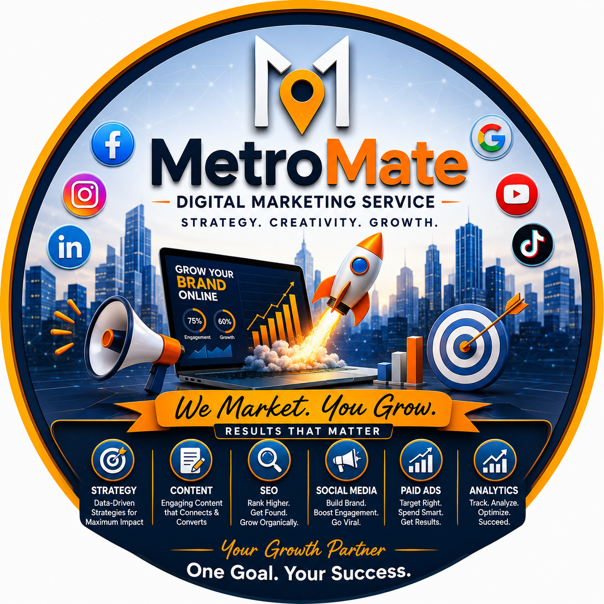

# 🚀 MetroMate — Performance Marketing Service

<div align="center">



> **Strategy. Creativity. Growth.**
> *We Market. You Grow. — Results That Matter.*

</div>

---

## 📌 Overview

**MetroMate** is a full-service performance marketing agency dedicated to helping brands grow online through data-driven strategy, creative content, and measurable results. This repository documents the **brand development project** for *Shiv Kathiawadi Thali* — a local food brand positioned for digital expansion.

---

## 🍽️ Project: Shiv Kathiawadi Thali — Brand Development

This project covers the end-to-end digital branding and performance marketing strategy for **Shiv Kathiawadi Thali**, a traditional Kathiawadi food brand based in Surat, Gujarat.

### 🎯 Project Goals

- Establish a strong digital brand identity
- Build a social media presence across key platforms
- Drive local and regional customer acquisition
- Optimize for Google Search and Google Maps visibility
- Launch targeted paid ad campaigns

---

## 🖼️ Brand Assets

| Asset | Description |
|---|---|
| `assets/metromate-brand-logo.jpg` | MetroMate Performance Marketing Service — official brand poster |

---

## 🛠️ Services Offered by MetroMate

| Service | Description |
|---|---|
| 📊 **Strategy** | Data-driven strategies for maximum impact |
| ✍️ **Content** | Engaging content that connects & converts |
| 🔍 **SEO** | Rank higher. Get found. Grow organically. |
| 📣 **Social Media** | Build brand. Boost engagement. Go viral. |
| 💰 **Paid Ads** | Target right. Spend smart. Get results. |
| 📈 **Analytics** | Track. Analyze. Optimize. Succeed. |

---

## 🌐 Platforms Covered

- 
- 
- 
- 
- 
- 

---

## 📂 Repository Structure

```
metromate-shiv-kathiawadi-thali-brand-development/
│
├── README.md                        # Project overview and documentation
├── BRAND_STRATEGY.md                # Brand strategy framework
├── SOCIAL_MEDIA_PLAN.md             # Platform-wise content plan
├── SEO_CHECKLIST.md                 # Local SEO and Google optimization
├── PAID_ADS_PLAN.md                 # Paid advertising strategy
├── ANALYTICS_FRAMEWORK.md          # KPIs and tracking setup
├── CONTRIBUTING.md                  # Contribution guidelines
├── LICENSE                          # MIT License
│
└── assets/
    └── metromate-brand-logo.jpg     # MetroMate brand identity poster
```

---

## 🚀 Getting Started

### Prerequisites

This is a documentation and strategy repository. No code installation is required.

### Usage

1. Clone the repository:
   ```bash
   git clone https://github.com/SNTL84/metromate-shiv-kathiawadi-thali-brand-development.git
   ```
2. Review the strategy documents in order:
   - Start with `BRAND_STRATEGY.md`
   - Follow with `SOCIAL_MEDIA_PLAN.md`
   - Implement `SEO_CHECKLIST.md` for local visibility
   - Execute `PAID_ADS_PLAN.md` for quick wins

---

## 📊 Key Metrics & Goals

| Metric | Target | Timeframe |
|---|---|---|
| Social Media Engagement | +75% | 3 months |
| Organic Growth | +60% | 6 months |
| Google Maps Reviews | 50+ | 2 months |
| Monthly Website Visitors | 5,000+ | 6 months |

---

## 🤝 Connect with MetroMate

| Platform | Link |
|---|---|
| 🌐 Website | Coming Soon |
| 📱 WhatsApp | [Contact Us](https://wa.me/919727413309) |
| 💼 LinkedIn | [SNTL2784](https://www.linkedin.com/in/sntl2784) |

---

## 📜 License

This project is licensed under the **MIT License** — see the [LICENSE](LICENSE) file for details.

---

<div align="center">

**Your Growth Partner — One Goal. Your Success.**

*MetroMate Performance Marketing Service*

</div>
